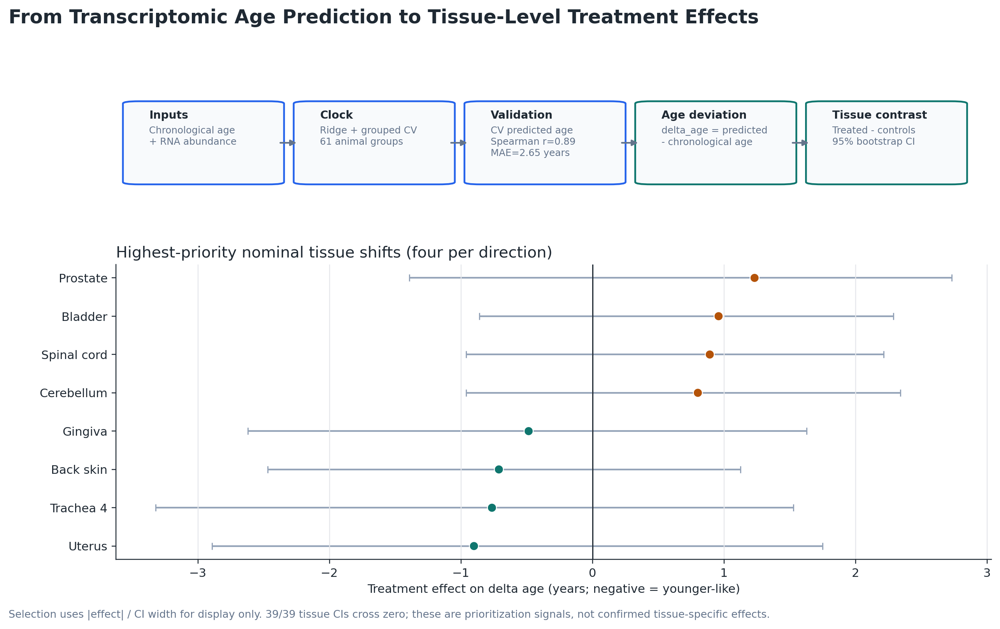
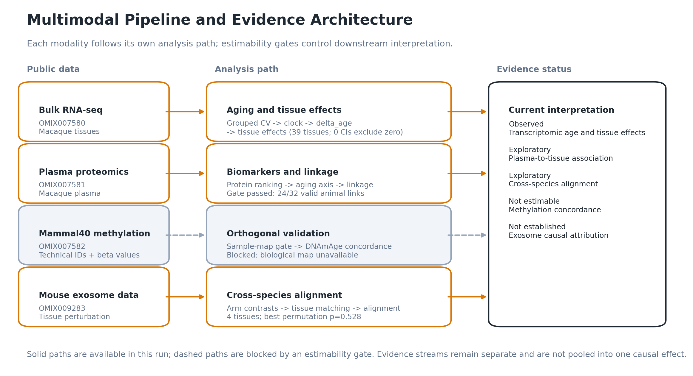
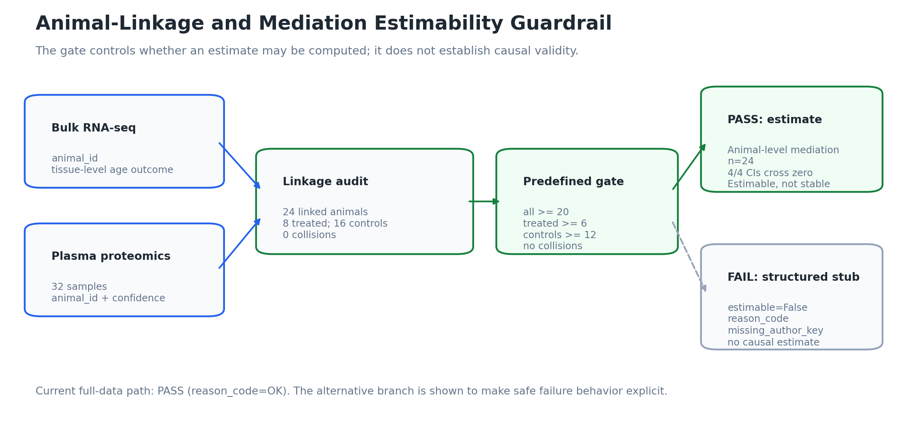

# OMIX Exosome Rejuvenation

**A reproducible primate multi-omics analysis of tissue-intrinsic and
plasma/exosome-associated aging signals.**

## What This Project Asks and Why It Matters

This project asks a focused but ambitious question:

> Do the rejuvenation-associated signals reported after senescence-resistant
> stem-cell treatment look more consistent with tissue-intrinsic change or with
> a plasma/exosome-associated mechanism?

Distinguishing these explanations matters because tissue-intrinsic change and
circulating carrier-associated activity imply different therapeutic targets,
biomarker strategies, and validation experiments. Public data can prioritize
these alternatives, but direct exosome causality would require recipient-level
exposure or cargo-transfer evidence that is not currently available.

The repository reanalyzes public OMIX transcriptomic, proteomic, methylation,
and supporting mouse data. It treats causal attribution as an estimability
problem: every mechanism-facing result carries sample counts, uncertainty,
evidence level, and an explicit reason when the public data cannot support the
intended claim.

## Evidence at a Glance

This table separates analysis availability, design level, and the scientific
status of each claim in the current full-data run:

| Evidence layer | Question | Claim status | Current result |
|---|---|---|---|
| Transcriptomic age model | Does tissue expression predict chronological age? | **Observed** | Grouped cross-validation across 61 animals gives Spearman `r = 0.89` and MAE `= 2.65` years. |
| Tissue treatment effects | Do treated tissues show younger-like transcriptomic age? | **Observed** | Effects are estimated in 39 tissues, but every confidence interval crosses zero. |
| Plasma proteomics | Is the circulating protein state associated with age or intervention? | **Exploratory** | Twenty-four of 32 plasma samples have high-confidence animal links; associations remain hypothesis-generating. |
| Macaque methylation | Is there independent epigenetic evidence of rejuvenation? | **Not estimable** | The Mammal40 technical-to-biological sample map is unavailable. |
| Macaque-mouse exosome alignment | Are macaque tissue effects concordant with mouse exosome perturbations? | **Exploratory** | Four shared tissues show limited directional agreement; permutation tests are not significant. |
| Plasma-tissue mediation | Can a linked plasma state statistically mediate the transcriptomic response? | **Exploratory** | The gate passes on 24 animals, but all four mediation-effect confidence intervals cross zero. |
| Causal attribution | Did exosomes cause the macaque rejuvenation response? | **Not established** | The public design lacks direct exosome exposure or cargo-to-recipient outcome linkage. |

`Observed` means directly estimated, not necessarily statistically supported.
`Supported` is reserved for a claim strengthened by concordant orthogonal
evidence; no current mechanism-facing claim meets that threshold.
`Exploratory` marks hypothesis-generating evidence. `Not estimable` identifies
a missing design or data requirement, whereas `Not established` means the
available analysis does not justify the requested mechanistic conclusion.

The defensible conclusion is not a numeric exosome-versus-cellular partition.
The public data currently support reproduction, guarded association, and
hypothesis generation while exposing the metadata needed for stronger causal
inference.

Read the full interpretation in [RESULTS.md](RESULTS.md).



*Figure 1. The clock is evaluated with animal-grouped cross-validation before
estimating tissue-level treatment shifts in `delta_age`. Displayed tissues are
prioritization candidates; all 39 tissue confidence intervals cross zero.*

## Evidence Architecture

The workflow combines scientific analysis with explicit estimability controls:

- A grouped cross-validated transcriptomic aging clock and uncertainty-aware
  tissue summaries.
- Conservative plasma-to-animal linkage with collision, coverage, and
  confidence audits.
- Animal-level mediation that cannot run silently when linkage assumptions
  fail.
- Cross-species exosome-alignment analysis kept separate from direct primate
  mediation.
- Orthogonal validation modules that emit structured limitations instead of
  filling metadata gaps by positional inference.
- A report layer that converts machine-readable result tables into
  interpretation-facing figures without recomputing the analysis.

### Design and Estimability Ladder

| Level | Design requirement reached | Current design state |
|---|---|---|
| 0 | Not estimable | Methylation biological validation |
| 1 | Macaque age and treatment-effect analysis | Estimable, tissue effects uncertain |
| 2 | Plasma association with valid animal linkage | Estimable on 24 linked animals; small cohort |
| 3 | Orthogonal exosome-alignment analysis | Design rung reached; no stable alignment support (`n = 4`) |
| 4 | Linked mediation estimable under stated assumptions | Estimable but unstable; not a causal partition |

Unlike the result summary above, this ladder records which design requirements
were reached. It does not replace effect uncertainty or automatically imply
strong support.

## Data and Workflow

The primary public datasets are:

- `OMIX007580`: macaque bulk transcriptomics.
- `OMIX007581`: macaque plasma proteomics.
- `OMIX007582`: Mammal40 methylation, currently limited by the missing sample
  map.
- `OMIX009283`: mouse exosome-related mechanism support.
- `OMIX007583`, `OMIX007586`, and `OMIX009284`: targeted validation or audited
  supporting resources, not additional primary cohorts.

The analysis proceeds through auditable, gated stages:

```text
Public OMIX data
  -> metadata, group-label, and identity audits
  -> grouped transcriptomic aging clock
  -> tissue rejuvenation summaries
  -> plasma linkage and oriented aging axis
  -> gated animal-level mediation

Mouse exosome perturbation -> cross-species alignment
Validation datasets        -> guarded orthogonal checks
Result CSVs                 -> interpretation-facing report figures
```



*Figure 2. Modalities contribute different forms of evidence. Mammal40
methylation remains blocked by missing sample identity, and mouse evidence is
orthogonal mechanism support rather than direct macaque validation.*

Group-label interpretation follows
[the canonical crosswalk](Documents/group_label_crosswalk.md). Raw inputs are
treated as immutable; derived tables and figures are written to `results/` and
`figures/`.

## Evidence and Claim Boundaries

A computable result is not necessarily scientifically estimable or biologically
established.

- **Linkage:** cross-modal animal identity must be supported by an explicit,
  auditable mapping. Unresolved plasma samples remain unresolved.
- **Estimability:** linkage-dependent analyses run only when predefined linkage
  and sample-size requirements are met.
- **Mediation:** animal-level mediation is treated as conditional evidence, not
  proof that plasma or exosomes caused rejuvenation.
- **Cross-species evidence:** mouse exosome perturbations can strengthen or
  challenge a mechanistic hypothesis, but they do not establish causality in
  macaques or humans.



*Figure 3. The current full-data linkage passes predefined sample and collision
criteria, permitting animal-level mediation. The estimates remain unstable;
the alternative branch shows the structured output written when the gate
fails.*

See the [scientific inference and estimability contract](Documents/inference_contract.md)
for the complete claim rules.

## Reproduce the Analysis

The demo profile uses the reduced example data distributed with the public
repository:

```bash
conda env create -f environment.yml
conda activate srsc
python -m src.run_pipeline --profile demo --safe
```

Run the scientific guardrail tests with:

```bash
python -m pytest -q tests/test_scientific_guardrails.py
```

Run the full-data profile only after placing the public source files in the
documented local data layout:

```bash
python -m src.run_pipeline --profile full
python -m src.report_figures
```

The full OMIX datasets are not redistributed here. Demo and full runs share the
same entry point and output schemas, but reduced demo data may produce different
estimability levels. See the [usage guide](docs/usage.md) for setup, profiles,
input expectations, and the optional R/Bioconductor workflow.

## Repository and Documentation

| Path | Purpose |
|---|---|
| `src/` | Analysis, audit, attribution, and reporting modules |
| `tests/` | Automated scientific guardrails and smoke tests |
| `data/PROCESSED/` | Reduced example inputs for the demo profile |
| `results/`, `figures/` | Generated machine-readable outputs and figures |
| `docs/` | Public usage and output-reference documentation |
| `Documents/` | Study design, inference contracts, audits, and scientific decision records |

Key reading paths:

- [Scientific results and interpretation](RESULTS.md)
- [Setup, profiles, and reproducible execution](docs/usage.md)
- [Result and figure reference](docs/output_reference.md)
- [Scientific objectives and claim rules](Documents/scientific_objectives_and_decision_framework.md)
- [Study design](Documents/study_design.md)
- [Public-data limitations and evidence ceiling](Documents/public_data_ceiling.md)
- [Mammal40 sample-map audit](Documents/OMIX007582_sample_map_audit.md)
- [PBMC single-cell audit](Documents/OMIX009284_audit.md)

Questions, reproducibility problems, and metadata corrections can be reported
through [GitHub Issues](https://github.com/richard2049/Omix-exosome-rejuvenation/issues).

## Citation and License

Please cite the repository using the metadata in [CITATION.cff](CITATION.cff).
The source code is distributed under the [MIT License](LICENSE).
